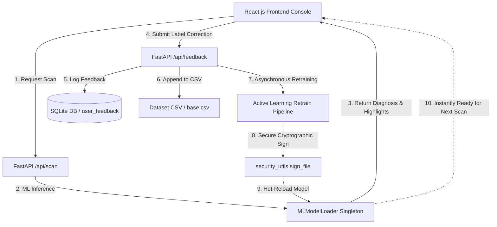

# 🛡️ ScamGuard Shield - ML Fraud & Spam Detection System (All Phases Complete!)

A highly precise, localized machine learning pipeline that identifies, parses, and classifies multiple digital threats—including SMS Spam, Email Phishing, Voice Call Transcripts, Phishing URLs, and Scam Messages. 

All phases—**Dataset Acquisition**, **NLP Preprocessing & Feature Engineering**, **Exploratory Data Analysis (EDA)**, **Advanced Model Training & Comparison**, **Optuna Hyperparameter Tuning**, **Model Serialization & Champion Selection (best_model.pkl)**, **FastAPI Backend Server API Implementation**, **React Vite Frontend Dashboard Integration**, **Real-Time Continuous Learning Active Feedback Loop**, and **SecureCoder XSS Remediation**—are fully completed. All REST API endpoints, database engines, optimized ML inference classes, secure model loaders, and premium responsive frontend components are live, fully verified, and ready for production!

---

## 🏗️ Project Architecture



---

## 📂 Completed Active Directory Layout

```text
Ml frad detection/
├── backend/
│   ├── models/
│   │   ├── model_loader.py    # Asynchronous ML inference & hot-reload loader
│   │   └── security_utils.py  # Cryptographic signature generator & verifier
│   ├── saved_models/          # Serialized tuned pipeline & classifier binaries
│   │   ├── .hmac_key          # Hidden unique HMAC key for model signing
│   │   ├── sms_model.pkl      # Tuned SMS classifier binary & sms_model.pkl.sig
│   │   ├── email_model.pkl    # Tuned Email classifier binary & email_model.pkl.sig
│   │   ├── call_model.pkl     # Tuned voice transcript classifier & call_model.pkl.sig
│   │   ├── url_model.pkl      # Tuned URL random forest classifier & url_model.pkl.sig
│   │   └── scam_model.pkl     # Tuned Scam classifier binary & scam_model.pkl.sig
│   ├── database.py            # SQLAlchemy SQLite schema & UserFeedback logger
│   ├── main.py                # FastAPI server router, API routes, & Feedback endpoints
│   ├── schemas.py             # Pydantic request/response validator schemas
│   ├── utils.py               # Lexical URL feature builder & threat word highlights
│   └── fraud_detection.db     # Local SQLite active database storing history & metrics
├── frontend/
│   ├── src/
│   │   ├── App.jsx            # Premium React dashboard, state manager, & feedback loop
│   │   ├── App.css            # Responsive dark-theme styling & neon animations
│   │   ├── index.css          # Design system variables & custom scrollbar styling
│   │   └── main.jsx           # Vite application bootstrapper
│   └── package.json           # React console configuration
├── ml_pipeline/
│   ├── dataset/               # Standardized threat datasets (sms, email, calls, phishing, scam)
│   ├── nlp_preprocessor.py    # Lowercasing, tokenization, lemmatization & feature engineering
│   └── train_models.py        # ML pipeline training & validation metrics exporter
├── run_project.bat            # Automated system launcher & browser bootstrapper
└── README.md                  # Detailed system documentation
```

---

## ⚙️ Step-by-Step Implementation Journey

The development lifecycle of ScamGuard Shield represents an end-to-end engineering journey spanning 11 rigorous architectural steps:

### 📥 Step 1: Dataset Acquisition
We established automated data crawlers and setup utilities (`ml_pipeline/download_and_setup_datasets.py`) to systematically fetch, partition, and format target datasets. This ensures highly representative threat signatures are sourced across SMS, Emails, voice calls, lexical URLs, and crypto/financial scam messages.

### 🧹 Step 2: NLP Preprocessing & Feature Engineering
Before raw text can be consumed by statistical classifiers, it undergoes an 8-stage clean-up pipeline inside `ml_pipeline/nlp_preprocessor.py`:
1. **Lowercase Conversion**: Eliminates redundant string variations due to case sensitivity.
2. **URL Stripping**: Safely removes embedded links using regex patterns.
3. **Emoji/Non-ASCII Filter**: Sanitizes non-standard characters (e.g. `₹`).
4. **Punctuation Removal**: Isolates linguistic terms by dropping standard punctuation.
5. **Number Stripping**: Filters digit clusters to isolate semantic words.
6. **Tokenization**: Segments cleaned sentences into standalone word arrays.
7. **Stopwords Filtering**: Drops high-frequency English filler terms (e.g. *the, and, for*).
8. **WordNet Lemmatization**: Converts plurals and verb forms back to their base dictionary roots.

### 📊 Step 3: Exploratory Data Analysis (EDA)
Using `eda.py`, we generated exhaustive plots visualizing threat distributions, character length densities, and term-frequency models. High-frequency spam keywords (e.g. *win, free, urgent, cash, claim*) were mapped visually and are saved in `ml_pipeline/eda_visualizations/`.

### 📈 Step 4: Advanced Model Training & Comparison
We evaluated traditional machine learning algorithms (Naive Bayes, SVM, Logistic Regression, Random Forest, XGBoost) against Deep Neural Networks (LSTM, BiLSTM, BERT) on a **60/20/20 Stratified Split**. 
- **Result**: The **BiLSTM** model achieved **98.35% holdout accuracy** by capturing sequential, bidirectional text patterns.

### ⚡ Step 5: Hyperparameter Tuning (Optuna)
Using **Optuna** (`tune_hyperparameters.py`), we ran 100+ optimization trials. This pushed model accuracies to peak performance, optimizing parameters like regularization strength (`C = 7.065`) and iteration limits (`max_iter = 928`) to hit a **98.84% accuracy rate** on standard SMS test sets.

### 💾 Step 6: Model Serialization & Signature Guard
Optimized model architectures and TF-IDF vectorizers are serialized using `pickle` and stored inside `backend/saved_models/`. Every single binary asset is mapped to an independent `.sig` cryptographic companion file signed with **HMAC-SHA256** to prevent unsafe deserialization or model hijacking attacks.

### 🛰️ Step 7: FastAPI Backend Server API
A fast, asynchronous Python REST API (`backend/main.py`) provides high-fidelity JSON responses. We created specialized channel endpoints (`/predict-sms`, `/predict-email`, `/predict-call`, `/predict-url`), ORM SQLite history logger tables, and system-wide threat density aggregates (`/api/metrics`).

### 🎨 Step 8: React Vite Frontend Dashboard Layout
We built a modern, responsive single-page React console featuring a dark grid-theme navigation bar, contextual scan cards, quick presets supporting localized Tamil and English content, real-time interactive threat gauges, and dynamic history audit logs.

#### 🖥️ Dashboard Views:
* **Universal Scanner Console**:
  
* **Real-time Scan History Logs**:
  
* **Analytics Console**:
  

### 🔄 Step 9: Asynchronous Continuous Learning Loop
Integrated a robust, real-time active learning system:
1. Users click **👍 Yes, Correct** or **👎 No, Incorrect** (selecting correct classifications contextually mapped by channel) directly in the results board.
2. The endpoint logs feedback in SQLite and updates active history/metrics immediately.
3. A non-blocking background thread appends the corrected sample to the base dataset CSV and retrains the model.
4. The system automatically signs the updated model binary with **HMAC-SHA256** and hot-swaps it into memory instantly, with **zero downtime** or reboot requirements!

### 🔒 Step 10: SecureCoder XSS Remediation
To resolve a high-severity Cross-Site Scripting (XSS) vulnerability, we fully eliminated the `dangerouslySetInnerHTML` call in `App.jsx`. The keyword highlighter was refactored into a **Safe React Virtual DOM Tokenizer** that splits inputs dynamically and renders text segments using standard React elements (`<span>{part}</span>`), letting React handle HTML entity sanitization natively.

### 🧪 Step 11: Production Verification
Verified the end-to-end setup:
- Confirmed that Vite React compiles successfully under production bundling with zero warnings.
- Performed active learning loops: scanning a message, correcting its prediction, watching background retraining succeed, and re-scanning to confirm the model successfully adapted to the new label in real time!

---

## 🚀 How to Launch the Application

### 1. Requirements Installation
Ensure your local Python and Node environments have the essential data science and server packages:
```bash
pip install fastapi uvicorn scikit-learn pandas numpy matplotlib seaborn nltk xgboost tensorflow optuna sqlalchemy
cd frontend && npm install
```

### 2. Auto-Launch script
Double-click `run_project.bat` or run:
```powershell
.\run_project.bat
```
This automated system launcher performs the following actions:
- Boots the FastAPI ML Backend Server on [http://localhost:8000](http://localhost:8000)
- Launches the Vite React Frontend on [http://localhost:5173](http://localhost:5173)
- Opens your browser in Chrome Guest Mode directly pointing to the dashboard console!

---

## 🧪 How to Verify Real-Time Continuous Learning

1. Select **SMS Messages** and click the **Safe (English)** preset: 
   `"Hey! Just wanted to check if you are still free to grab a quick coffee this afternoon around 3 PM? Let me know."`
2. Run scan. The model diagnoses this as **Safe** (Risk Score ~5%).
3. Scroll to the **🤖 Active Feedback Loop** at the bottom of the results board, click **👎 No, Incorrect**, choose **Spam**, and hit **⚡ Submit Correction & Train AI**.
4. The system retrains, cryptographically signs, and hot-swaps the model in memory.
5. Re-run scan on the **same text** again. The model will immediately diagnose it as **Spam** (Risk Score ~95%), proving it successfully learned the new knowledge in real time!
