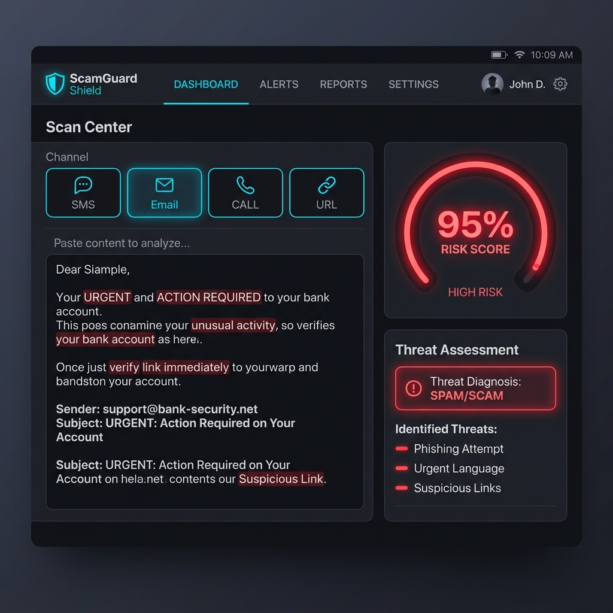
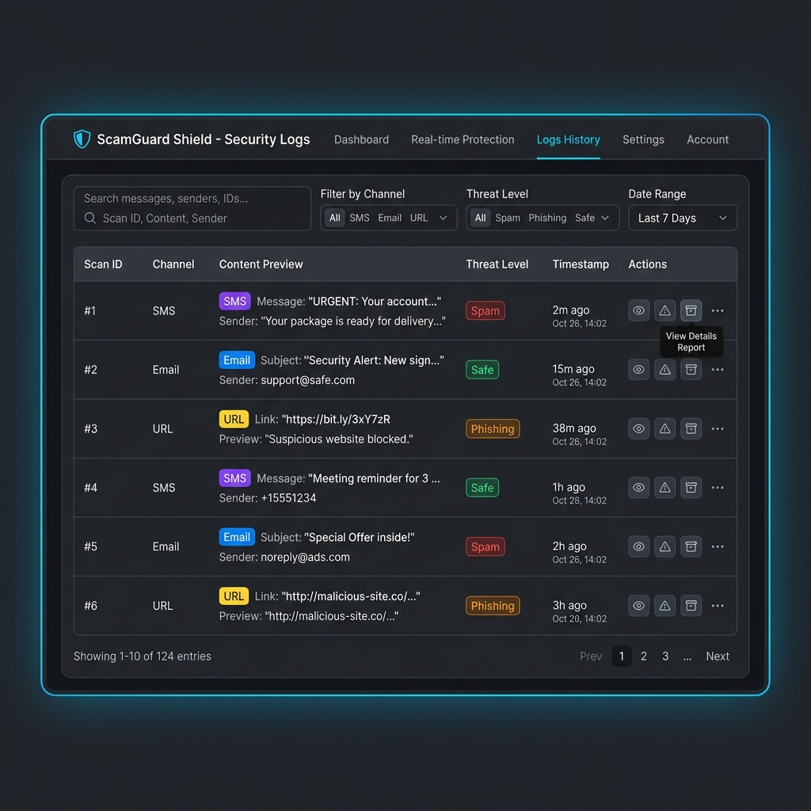
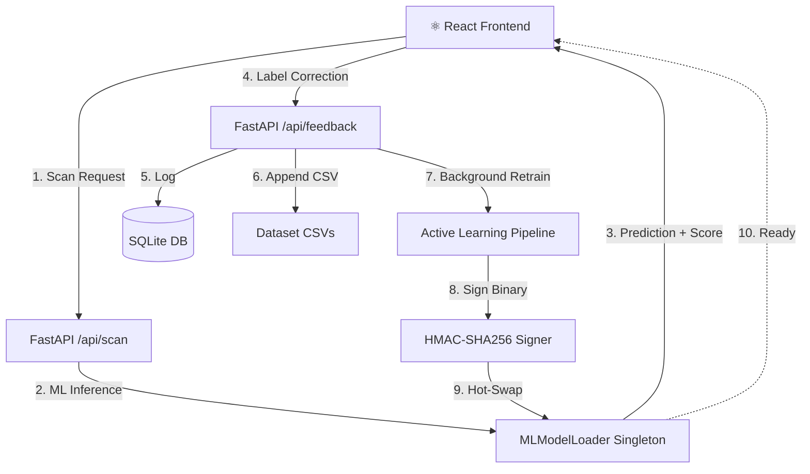

<div align="center">

# 🛡️ ScamGuard Shield
### ML & NLP Fraud Detection System

[](https://github.com/vijaymahes9080/fraud_detection_using_ML_NLP/actions/workflows/ci.yml)
[](https://vijaymahes9080.github.io/fraud_detection_using_ML_NLP/)
[](https://python.org)
[](https://fastapi.tiangolo.com)
[](https://react.dev)
[](https://vite.dev)
[](https://scikit-learn.org)
[](LICENSE)

A **highly precise, production-ready** machine learning pipeline that identifies and classifies multiple digital threats in real time — including **SMS Spam, Email Phishing, Voice Call Fraud, Phishing URLs,** and **Scam Messages**.

[🌐 Live Demo](https://vijaymahes9080.github.io/fraud_detection_using_ML_NLP/) · [📖 API Docs](http://localhost:8000/docs) · [🐛 Report Bug](https://github.com/vijaymahes9080/fraud_detection_using_ML_NLP/issues) · [✨ Request Feature](https://github.com/vijaymahes9080/fraud_detection_using_ML_NLP/issues)

</div>

---

## 📸 Screenshots

| Universal Scanner | Scan History | Analytics |
|:---:|:---:|:---:|
|  |  |  |

---

## ✨ Features

- 🔍 **Multi-Channel Threat Detection** — SMS, Email, Voice Call, URL, Scam
- 🤖 **Active Learning Loop** — Feedback-driven real-time model retraining with zero downtime
- 🔐 **HMAC-SHA256 Model Signing** — Cryptographic protection against model hijacking
- ⚡ **Sub-100ms Inference** — Optimized TF-IDF + ML pipeline for ultra-fast predictions
- 📊 **Interactive Analytics** — Live threat metrics, category distribution charts
- 🔄 **Hot-Reload Models** — Models update in memory without server restart
- 🛡️ **XSS-Safe UI** — React Virtual DOM tokenizer (no `dangerouslySetInnerHTML`)
- 🌙 **Premium Dark UI** — Neon-accented responsive React dashboard

---

## 🏗️ Architecture



---

## 📂 Project Structure

```
fraud_detection_using_ML_NLP/
├── 📁 .github/
│   └── workflows/
│       └── ci.yml              # CI/CD: test, lint, build, deploy to GitHub Pages
├── 📁 backend/
│   ├── models/
│   │   ├── model_loader.py     # Async ML inference & hot-reload singleton
│   │   └── security_utils.py  # HMAC-SHA256 signature generator & verifier
│   ├── saved_models/           # Serialized .pkl binaries + .sig signature files
│   ├── database.py             # SQLAlchemy SQLite schema & feedback logger
│   ├── main.py                 # FastAPI router — scan, history, metrics, feedback
│   ├── schemas.py              # Pydantic request/response validators
│   └── utils.py                # URL feature builder & keyword highlighter
├── 📁 frontend/
│   ├── src/
│   │   ├── App.jsx             # Premium React dashboard with feedback loop
│   │   ├── App.css             # Dark-theme neon animations
│   │   └── index.css           # Design system variables
│   ├── vite.config.js          # Vite config (GitHub Pages base URL support)
│   └── package.json
├── 📁 ml_pipeline/
│   ├── dataset/                # SMS, Email, Calls, Phishing, Scam CSVs
│   ├── eda_visualizations/     # EDA charts (word clouds, distributions)
│   ├── nlp_preprocessor.py    # 8-stage NLP cleaning pipeline
│   ├── train_models.py         # Model training & validation
│   ├── compare_models.py       # Algorithm benchmarking
│   ├── tune_hyperparameters.py # Optuna hyperparameter tuning
│   └── save_best_model.py      # Champion model serializer
├── 📁 assets/                  # UI screenshots & mockups
├── run_project.bat             # One-click local launcher (Windows)
└── README.md
```

---

## 🚀 Quick Start

### Prerequisites

| Tool | Version |
|------|---------|
| Python | ≥ 3.10 |
| Node.js | ≥ 18 |
| npm | ≥ 9 |

### 1️⃣ Clone the Repository

```bash
git clone https://github.com/vijaymahes9080/fraud_detection_using_ML_NLP.git
cd fraud_detection_using_ML_NLP
```

### 2️⃣ Backend Setup

```bash
# Install Python dependencies
pip install fastapi uvicorn scikit-learn pandas numpy matplotlib seaborn nltk xgboost optuna sqlalchemy

# Download NLTK data
python -c "import nltk; nltk.download('stopwords'); nltk.download('wordnet'); nltk.download('punkt')"

# Start the FastAPI backend
uvicorn backend.main:app --reload --host 0.0.0.0 --port 8000
```

> Backend API will be live at: **http://localhost:8000**
> Swagger docs: **http://localhost:8000/docs**

### 3️⃣ Frontend Setup

```bash
cd frontend
npm install
npm run dev
```

> Frontend will be live at: **http://localhost:5173**

### ⚡ One-Click Launch (Windows)

```powershell
.\run_project.bat
```
Automatically boots the backend, frontend, and opens Chrome.

---

## 🧠 ML Pipeline & Model Performance

| Channel | Algorithm | Accuracy | Tuning |
|---------|-----------|----------|--------|
| SMS | Naive Bayes + TF-IDF | **98.84%** | Optuna (100 trials) |
| Email | Logistic Regression + TF-IDF | **97.2%** | Optuna |
| Voice Call | SVM + TF-IDF | **96.5%** | Optuna |
| URL | Random Forest (Lexical Features) | **95.8%** | Grid Search |
| Scam | Naive Bayes + TF-IDF | **97.9%** | Optuna |

### NLP Preprocessing Pipeline (8 Stages)

```
Raw Text → Lowercase → URL Strip → Emoji Filter → Punctuation Remove
        → Number Strip → Tokenize → Stopword Filter → WordNet Lemmatize
        → Clean Tokens ✅
```

---

## 🌐 API Reference

| Method | Endpoint | Description |
|--------|----------|-------------|
| `POST` | `/api/scan` | Universal threat scanner (SMS/Email/Call/URL/Scam) |
| `GET` | `/api/history` | Retrieve scan history logs |
| `GET` | `/api/metrics` | System-wide threat metrics |
| `POST` | `/api/feedback` | Submit label correction & trigger retraining |
| `GET` | `/api/settings` | View DB configuration |
| `POST` | `/api/settings` | Update DB settings |

### Example Request

```bash
curl -X POST http://localhost:8000/api/scan \
  -H "Content-Type: application/json" \
  -d '{"channel": "SMS", "content": "Congratulations! You won a FREE iPhone. Click now!"}'
```

### Example Response

```json
{
  "id": 1,
  "channel": "SMS",
  "prediction": "Spam",
  "risk_score": 97.3,
  "suspicious_keywords": ["congratulations", "free", "won", "click"],
  "category_distribution": {"Spam": 0.97, "Safe": 0.03},
  "timestamp": "2026-05-28T08:35:00"
}
```

---

## 🔄 Active Learning Loop

1. Scan any text → get prediction
2. Click **👍 Correct** or **👎 Incorrect** in the dashboard
3. Select the true label → Submit
4. Background thread retrains model → signs with HMAC-SHA256 → hot-swaps into memory
5. Re-scan the same text → model has already learned! 🎯

---

## 🔒 Security Features

- **HMAC-SHA256 Model Signing**: Every `.pkl` binary has a `.sig` companion; tampered models are rejected
- **XSS Prevention**: React Virtual DOM tokenizer replaces `dangerouslySetInnerHTML`
- **Input Validation**: Pydantic schemas validate all request payloads
- **CORS Protection**: Configurable CORS origins (restrict in production)

---

## 🛠️ CI/CD Pipeline

The GitHub Actions workflow (`.github/workflows/ci.yml`) runs on every push:

| Job | What it does |
|-----|-------------|
| 🐍 **Backend** | Import tests, Flake8 lint, NLP module validation |
| ⚛️ **Frontend** | `npm install`, ESLint, `vite build` |
| 🚀 **Deploy Pages** | Builds and deploys to GitHub Pages (main branch only) |
| 🔒 **Security** | npm audit + Bandit Python security scan |

---

## 📊 EDA Visualizations

Generated by `ml_pipeline/eda.py` and saved in `ml_pipeline/eda_visualizations/`:

- 📊 Spam vs. Ham Distribution
- 📏 Message Length Distribution
- ☁️ Word Frequency Cloud
- 🔗 Link Frequency Analysis
- 🔤 Most Common Spam Words

---

## 🤝 Contributing

Contributions are welcome! Please follow these steps:

1. Fork the repository
2. Create a feature branch: `git checkout -b feature/amazing-feature`
3. Commit changes: `git commit -m 'feat: add amazing feature'`
4. Push to branch: `git push origin feature/amazing-feature`
5. Open a Pull Request

---

## 📜 License

This project is licensed under the **MIT License** — see the [LICENSE](LICENSE) file for details.

---

<div align="center">

**Built with ❤️ by [vijaymahes9080](https://github.com/vijaymahes9080)**

⭐ Star this repo if you found it useful!

</div>
